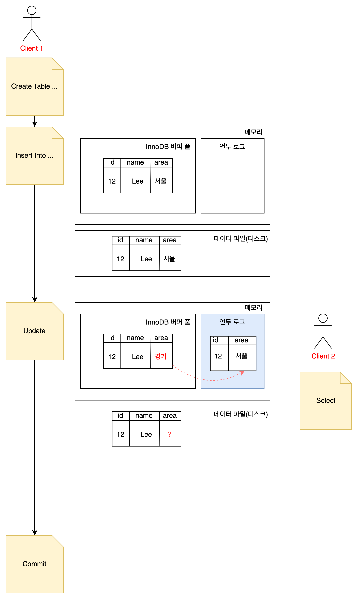
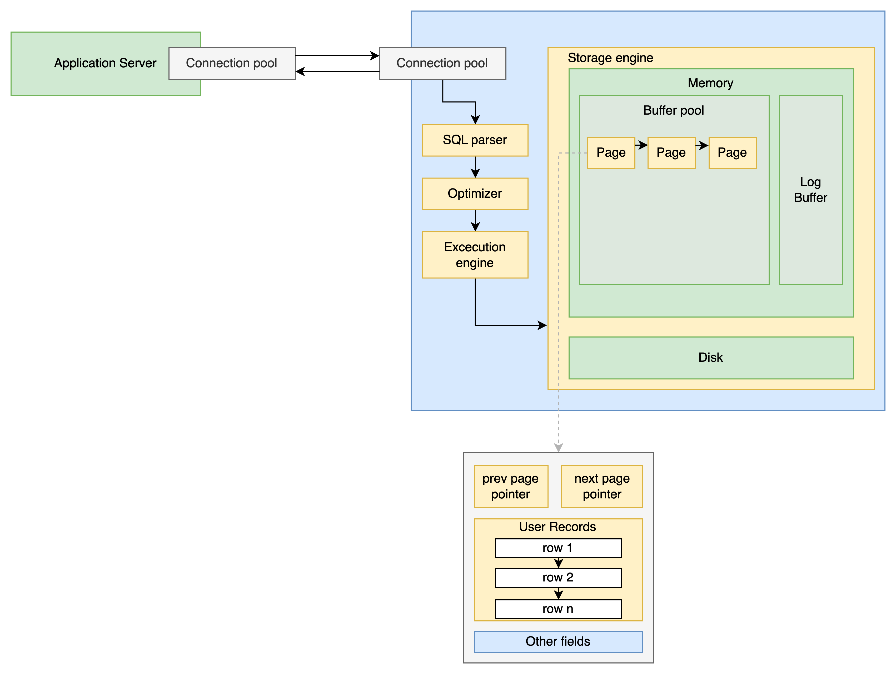

## InnoDB 스토리지 엔진 아키텍처
- InnoDb 는 MySQL에서 사용할 수 있는 스토리지 엔진 중 거의 유일하게 레코드 기반의 잠금을 제공한다.
- 이 덕분에 높은 동시성 처리가 가능하고 안정적이며 성능이 뛰어나다.

## 프라이머리 키에 의한 클러스터링
- InnoDB : 클러스터링된 인덱스 사용
    - 장점 : 프라이머리 키를 이용한 레인지 스캔 빨리 처리될 수 있음.
    - 
- MyISAM : 클러스터링된 키 지원하지 않음.

## MVCC (Multi Version Concurrency Control)
- 하나의 레코드에 대해 여러 개의 버전이 동시에 관리된다.
- 목적 : 일관된 읽기
- 어떻게 동작?
  - InnoDB 는 언두 로그(Undo log)를 이용해 이 기능을 구현한다.
  - READ_COMMIT 인 서버에서 테이블 변경 처리 과정
    
    1. update 문장이 실행되면 커밋 실행 여부와 관계없이 버퍼 풀은 새로운 값으로 업데이트 된다.
    2. area 칼럼의 변경 전 값만 언두 로그 영역에 복사된다.
    3. 디스크의 데이터 파일에는 체크포인트나 innoDB Write 스레드에 의해 새로운 값으로 업데이트돼 있을 수도 있고 아닐 수도 있음.
    ```text
    mysql> SELECT * FROM member WHERE id=12;
    
    아직 commit 이나 rollback이 되지 않은 상태에서
    다른 사용자가 레코드를 조회하면 어디에 있는 데이터를 조회할 까?
    ```
    -> **```transaction_isolation``` 시스템 변수에 설정된 격리 수준에 따라 다르다.**
    - READ_UNCOMMITED : 버퍼 풀이 현재 가지고 있는 변경된 데이터를 읽어서 반환한다. 
    - READ_COMMITED, REPEATABLE_READ, SERIALIAZBLE : 변경되기 이전의 내용을 보관하고 있는 언두 영역의 데이터 반환한다.
  - 정리 : 하나의 레코드에 대해 2개의 버전이 유지되고, 필요에 따라 어느 데이터가 보여지는지 여러 가지 상황에 따라 달라지는 구조.
  - 단점 : 트랜잭션이 길어지면 언두에서 관리하는 예전 데이터가 삭제되지 못하고 오랫동안 관리돼야 하며, 자연히 언두 영역이 저장되는 시스템 테이블 스페이스의 공간이 많이 늘어나는 상황이 발생할 수도 있음.
  - 언두 영역의 내용은 언제 삭제 되는 가? 
    - 이 언두 영역을 필요로 하는 트랜잭션이 더는 없을 떄.
    
## 잠금 없는 일관된 읽기
- innoDB 스토리지 엔진은 MVCC 기술을 이용해 잠금을 걸지 않고 읽기 작업을 수행한다. 
  다른 트랜잭션이 가지고 있는 잠금을 기다리지 않고, 읽기 작업이 가능하다.

## 자동 데드락 감지
- InnoDB 스토리지 엔진은 내부적으로 잠금이 교착 상태에 빠지지 않았는지 체크하기 위해 잠금 대기 목록을 그래프 형태로 관리한다.
- 언두 로그 레코드를 더 적게 가진 트랜잭션이 롤백의 대상이 된다.
- ```innodb_table_locks``` 시스템 변수를 활성화 하면 스토리지 엔진 내부의 레코드 잠금뿐만 아니라 테이블 레벨의 잠금까지 감지할 수 있게 된다.
- ```innodb_deadlock_detect=off``` :  
  데드락 감지 스레드가 데드락을 찾아낼 때 동시 처리 스레드가 매우 많아지거나 각 트랜잭션이 가진 감금의 개수가 많아지면 데드락 감지 스레드가 느려진다.  
  이런 경우를 위해 데드락 감지 스레드 활동을 꺼줄 수 있다. 
- ```innodb_deadlock_detect=off``` and ```innodb_lock_wait_timeout``` 데드락 감지 스레드를 꺼두면, 중재자가 없어 2개 이상의 트랜잭션이 무한정 대기하게 될 것이다. Timeout 설정을 통해 일정 시간이 지나면 실패 처리를 하게 만들 수 있다. 

## 자동화된 장애 복구
- 기본적으로 InnoDB 데이터 파일은 기본적으로 MySQL 서버가 시작될 때 항상 자동 복구를 수행한다.  
  이 단계에서 자동으로 복구될 수 없는 손상이 있다면 자동 복구를 멈추고 MySQL 서버는 종료돼 버린다.
- ```innodb_force_recovery``` 시스템 변수 - [Forcing InnoDB Recovery](https://dev.mysql.com/doc/refman/8.0/en/forcing-innodb-recovery.html)
- 1~6 까지 숫자가 커질수록 심각한 상황이여서 데이터 손실 가능성이 커지고 복구 가능성은 작아진다. 
- 위 옵션값을 모두 설정해도 서버가 시작되지 않으면 백업을 이용해 다시 구축하는 방법밖에 없다. 

## InnoDB 버퍼 풀
- InnoDB 스토리지 엔진에서 가장 핵심적인 부분
- 디스크의 데이터 파일이나 인덱스 정보를 메모리에 **캐시**해 두는 공간


- 버퍼풀의 구조
  1. LRU (Least Recently Used) 리스트
  2. Flush List
  3. Free List

- LUR list

  - LRU + MRU 리스트가 결합된 형태
  - Old 서브리스트 영역은 LRU, New 서브리스트 영역은 MRU 
  - 사용 목적: 디스크로부터 한 번 읽어온 페이지를 최대한 오랫동안 InnoDB 버퍼풀의 메모리에 유지해서 디스크 읽기를 최소화 하기 위해.
- Flush List

## 버퍼 풀과 리두 로그

## 버퍼 풀 플러시

## 언두 로그

## 체인지 버퍼

## 리두 로그 및 로그 버퍼

## 어댑티브 해시 인덱스