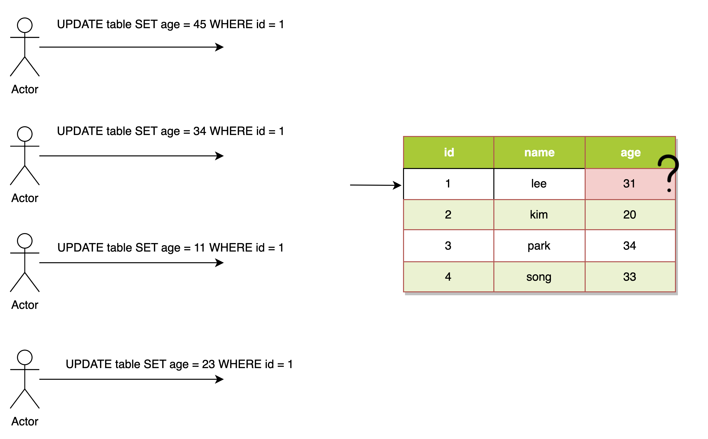
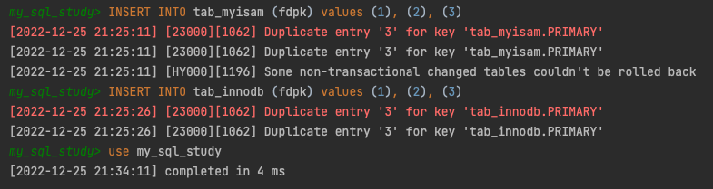
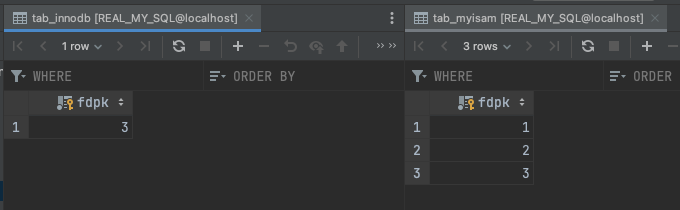
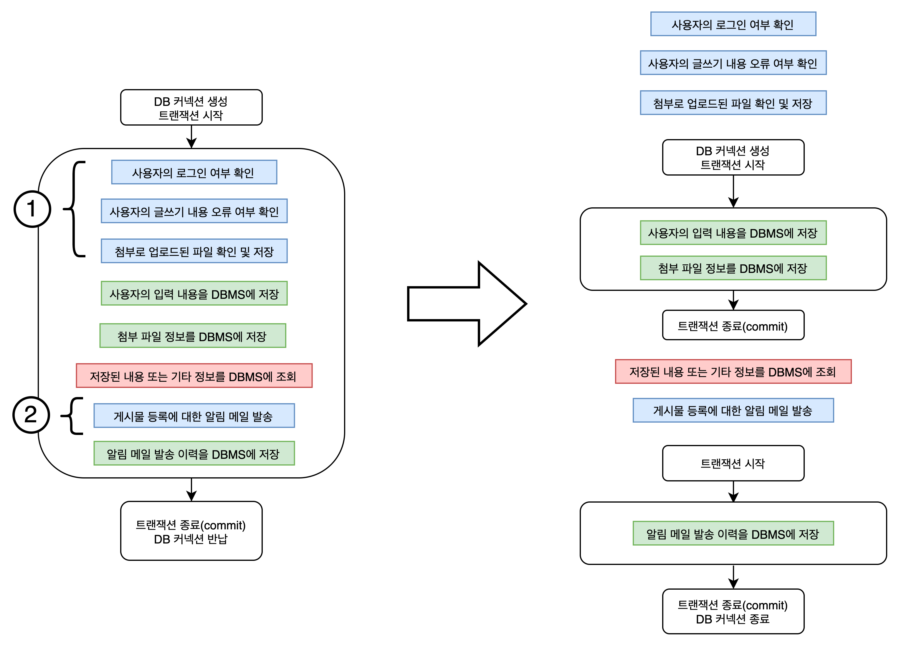
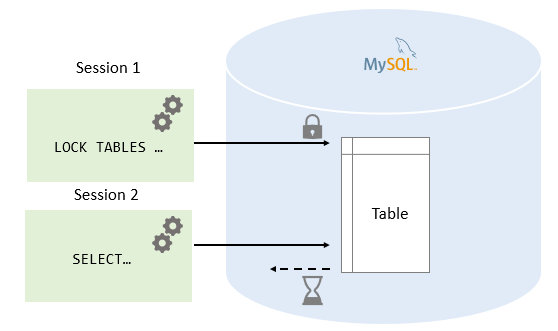

# 잠금(Lock)
- **동시성**을 제어하기 위한 기능

- 잠금은 여러 커넥션에서 동시에 동일한 자원을 요청할 경우 순서대로 한 시점에는 하나의 커넥션만 변경할 수 있게 해주는 역할을 한다.
# 트랜잭션
- **데이터의 정합성**을 보장하기 위한 기능
- 작업의 완전성을 보장해 주는 것
- 논리적인 작업 셋을 모두 완벽하게 처리하거나, 못할 경우에는 원 상태로 복구해서 작업의 일부만 적용되는 현상이 발생하지 않게 만들어주는 기능

---

# 트랜잭션
### 트랜잭션을 지원하지 않는 MyISAM vs 지원하는 InnoDB의 처리 방식 차이

```mysql
-- MyISAM 을 사용하는 테이블 생성
CREATE TABLE tab_myisam (fdpk INT NOT NULL , PRIMARY KEY (fdpk)) ENGINE = MyISAM;
-- 프라이머리키 컬럼 fdpk에 데이터 insert
INSERT INTO tab_myisam (fdpk) values (3);

-- INNODB 를 사용하는 테이블 생성
CREATE TABLE tab_innodb (fdpk INT NOT NULL , PRIMARY KEY (fdpk)) ENGINE = INNODB;
-- 프라이머리키 컬럼 fdpk에 데이터 insert
INSERT INTO tab_innodb (fdpk) values (3);

-- AUTO-COMMIT 모드 활성
SET autocommit =ON;

-- fdpk에 데이터 1, 2, 3 insert
INSERT INTO tab_myisam (fdpk) values (1), (2), (3);
INSERT INTO tab_innodb (fdpk) values (1), (2), (3);
```
insert 문 실행하면 프라이머리키 중복 오류 발생
 

결과 확인  \

#
MyISAM 테이블에는 오류가 발생했음에도 '1'과 '2'는 INSERT 된 상태로 남아 있다.
로그에서도 롤백될 수 없음을 알려준다.
```shell
Some non-transactional changed tables couldn't be rolled back
```
InnoDB는 쿼리 중 일부라도 오류가 발생하면 전체를 원 상태로 만든다는 트랜잭션의 원칙대로 INSERT 문장을 실행하기 전 상태로 그대로 복구했다.

MyISAM 테이블에서 발생하는 이러한 현상을 부분 업데이트(Partial Update)라고 표현하며, 이러한 부분 업데이트 현상은 테이블 데이터의 정합성을 맞추는데 상당히 어려운 문제를 만들어 낸다.  

### 주의사항
- 트랜잭션 또한 DBMS의 커넥션과 동일하게 꼭 필요한 최소의 코드에만 적용하는 것이 좋다.  
-> 프로그램 코드에서 트랜잭션의 범위를 최소화 하라는 의미다.

예시로 살펴보자.

서비스 기능중 '사용자 게시물 등록' 이 있다.   
왼쪽은 이 기능에 연관된 모든 로직이 하나의 트랜잭션안에 있는 경우다.

- 데이터베이스 커넥션은 개수가 제한적이다.  
각 단위 프로그램이 커넥션을 소유하는 시간이 길어질수록 사용 가능한 여유 커넥션 개수는 줄어들 것이다.  
그리고 어느 순간에는 각 단위 프로그램에서 커넥션을 가져가기 위해 기다려야 하는 상황이 발생할 수도 있다.
- 네트워크 작업은 무조건 트랜잭션과 분리하자.  
원격 서버와 통신할 수 없는 상황이 발생한다면 DBMS 서버까지 위험해지는 상황이 발생한다.
- 연관된 작업끼리 트랜잭션을 구성하자.

# MySQL 엔진의 잠금
- 스토리지 엔진 레벨
- MySQL 엔진 레벨
  - 테이블 락
  - 메타데이터 락
  - 네임드 락

MySQL 엔진 레벨의 잠금은 모든 스토리지 엔진에 영향을 미치지만, 
스토리지 엔진 레벨의 잠금은 스토리지 엔진 간 상호 영양을 미치지는 않는다.

### 글로벌 락
- MySQL 에서 제공하는 잠금 가운데 가장 범위가 큼
- 한 세션에서 글로벌 락을 획득하면 다른 세션에서 SELECT 를 제외한 대부분의 DDL 문장이나 DML 문장을 실행하는 경우 글로벌 락이 해제될 때까지 해당 문장이 대기 상태로 남는다.
- InnoDB 스토리지 엔진은 트랜잭션을 지원하기 때문에 일관된 데이터 상태를 위해 모든 데이터 변경 작업을 멈출 필요는 없다.
- 가벼운 글로벌 락 : 백업 락
  특정 세션에서 백업 락 획득 시
  - 변경 불가능
    1. 데이터베이스 및 테이블 등 모든 객체 생성 및 변경, 삭제
    2. REPAIR TABLE 과 OPTIMIZE TABLE 명령
    3. 사용자 관리 및 비밀번호 변경
  - 변경 가능
    1. 일반적인 테이블의 데이터 변경  
    
  MySQL 서버의 백업 락은 정상적으로 복제는 실행되지만 백업의 실패를 막기 위해 DDL 명령이 실행되면 복제를 일시 중지하는 역할을 한다. 

### 테이블 락

- 한 세션이 테이블의 잠금을 획득하면 이 획득 시간동안 다른 세션에서는 해당 테이블에 접근할 수 없도록 하는 기능이다.
- 개별 테이블 단위로 설정되는 잠금
- 명시적 락, 묵시적 락
```mysql
-- 명시적 테이블 락 획득
LOCK TABLES [READ | WRITE]
-- 명시적 테이블 락 반납
UNLOCK TABLES
```
- 명시적 락은 특별한 상황이 아니면 애플리케이션에서 사용할 필요가 거의 없다.
- 묵시적 테이블 락은 MyISAM이나 MEMORY 테이블에 **데이터를 변경하는 쿼리를 실행하면 발생**한다.
- 묵시적 테이블 락에서 InnoDB 테이블의 경우 스토리지 엔진 차원에서 레코드 기반의 잠금을 제공하기 때문에
  테이블 락이 설정되지만 DML 쿼리에서는 무시되고 DDL 경우에만 영향을 미친다.

### 네임드 락
https://gywn.net/2013/12/mysql-user-level-lock/