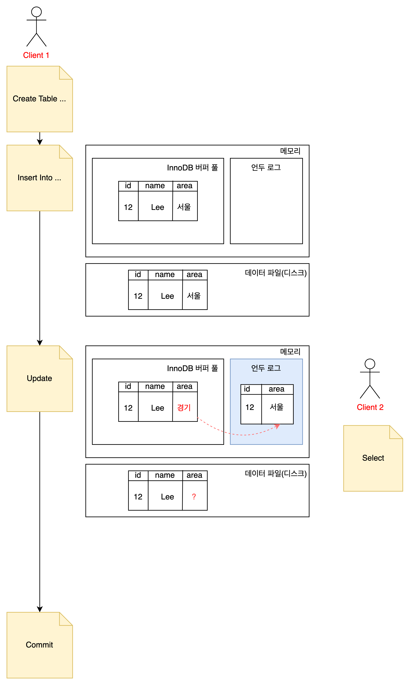

# 5.4 MySQL의 격리 수준

- 트랜잭션의 격리 수준(isolation level) 이란 여러 트랜잭션이 동시에 처리될 때  
특정 트랜잭션이 다른 트랜잭션에서 변경하거나 조회하는 데이터를 볼 수 있게 허용할지 말지를 결정하는 것이다.

- 격리 수준은 크게 4가지가 있음
  - READ UNCOMMITTED, READ COMMITTED, REPEATABLE READ, SERIALIZABLE

- 데이터베이스의 격리 수준을 이야기하면 항상 함께 언급되는 세 가지 부정합의 문제점이 있다. 

|                  | Dirty Read | Non-Repeatable Read | Phantom read    |
|------------------|------------|---------------------|-----------------|
| READ UNCOMMITTED | 발생         | 발생                  | 발생              |
| READ COMMITTED   | 없음         | 발생                  | 발생              |
| REPEATABLE READ  | 없음         | 없음                  | 없음 (InnoDB는 없음) |
| SERIALIZABLE     | 없음         | 없음                  | 없음              |

- 일반적인 데이터베이스는 READ COMMITTED 와 REPEATABLE READ 중 하나를 사용한다.
  MySQL 에서는 주로 REPEATABLE READ 을 사용한다.

#

초기 상태가 아래와 같은 Employee 테이블로 격리수준을 실습해보겠다.
```set autocommit = false;``` 설정으로 진행한다.

 

## READ UNCOMMITTED

```sql
-- 트랜잭션 1
SET SESSION transaction isolation level READ UNCOMMITTED;
START TRANSACTION;


INSERT INTO employee (name) VALUES ('CHOI');

```

```sql
-- 트랜잭션 2
SET SESSION transaction isolation level READ UNCOMMITTED;
START TRANSACTION;

SELECT * FROM employee;
```


트랜잭션 1에서 commit 을 하지 않았음에도 트랜잭션 2에서도 트랜잭션 1 에서 INSERT 한 row 를 조회한다.  

이 처럼 어떤 트랜잭션에서 처리한 작업이 완료되지 않았는데도 다른 트랜잭션에서 볼 수 있는 현상을 **더티 리드(Dirty Read)**라 한다.  
RDBMS 표준에서는 트랜잭션의 격리 수준으로 인정하지 않을 정도로 정합성에 문제가 많은 격리 수준이다.

## READ COMMITTED
- Dirty read 같은 현상은 발생하지 않는다. 
- 어떤 트랜잭션에서 데이터를 변경했더라도 **COMMIT 이 완료된 데이터만** 다른 트랜잭션에서 조회할 수 있다.
#
이번엔 트랜잭션 2에서는 트랜잭션 1에서 INSERT 한 row가 조회되지 않는다.
  

MySQL 은 언두로그로 READ COMMITTED 를 처리한다.  
```
아래 사진은 2주차 스터디때 학습한 내용이다.   
트랜잭션 1에서 INSERT 를 하면 변경 되기 전 데이터가 언두로그에 저장이 된다.  
트랜잭션 2는 언두로그에서 데이터를 조회한다.
```



- READ COMMITTED 의 문제점
  - NON-REPEATABLE READ 라는 부정합 문제
  
    
  
    하나의 트랜잭션 내에서 똑같은 SELECT 쿼리를 실행했을 때는 항상 같은 결과를 가져와야 한다는 REPEATABLE READ 정합성에 어긋난다.

## REPEATABLE READ

- MySQL 의 InnoDB 스토리지 엔진에서 기본으로 사용되는 격리 수준이다. 
- 바이너리 로그를 가진 MySQL 서버에서는 최소 REPEATABLE READ 격리 수준 이상을 사용해야 한다.
- 이 격리 수준에서는 NON-REPEATABLE READ 부정합이 발생하지 않는다.
- InnoDB 스토리지 엔진은 변경되기 전 레코드를 언두 공간에 백업하여 동일 트랜잭션 내에서는 동일한 결과를 보여줄 수 있게 보장한다.
- ***READ COMMITTED 와의 차이는 언두 영역에 백업된 레코드의 여러 버전 가운데 몇 번째 이전 버전까지 찾아 들어가야 하느냐에 있다.***

  
  
  예를 들면 그림에서 사용자 B 의 트랜잭션에 할당된 번호인 10을 기준으로 10보다 앞선 트랜잭션 번호의 데이터만 언두 로그 영역에서 조회한다.  
  사용자 A 트랜잭션에 할당된 12번은 10번 보다 나중이므로 사용자 B 트랜잭션에서는 12번 트랜잭션에서 생성된 데이터를 조회하지 않는 것이다.
- 그럼에도 부정합이 발생할 수 있다. (InnoDB 는 아님)

  

  사용자 B 트랜잭션에서는 SELECT 결과가 모두 같아야 하나 ```SELECT ... FOR UPDATE ``` 는 그렇지 못하다.
  ```
  이처럼 데이터가 보였다 안 보였다 하는 현상을 PHANTOM READ 또는 PHANTOM ROW 라고 한다.
  ```
  이 쿼리는 언두 레코드에는 잠금을 걸 수 없기 때문이다. 그래서 언두 영역의 변경 전 데이터를 가져오는 것이 아니라 현재 레코드의 값을 가져오게 되는 것이다. 

## SERIALIZABLE
- 가장 엄격한 격리 수준이다. 한 트랜잭션에서 읽고 쓰는 레코드를 다른 트랜잭션에서는 절대 접근할 수 없다. 
- PHANTOM READ 문제 발생하지 않는다. 
- InnoDB 스토리지 엔진에서는 갭 락과 넥스트 키 락 덕분에 팬텀 리드가 발생하지 않기 때문에 굳이 이 격리 수준을 사용할 필요성은 없어 보인다. 