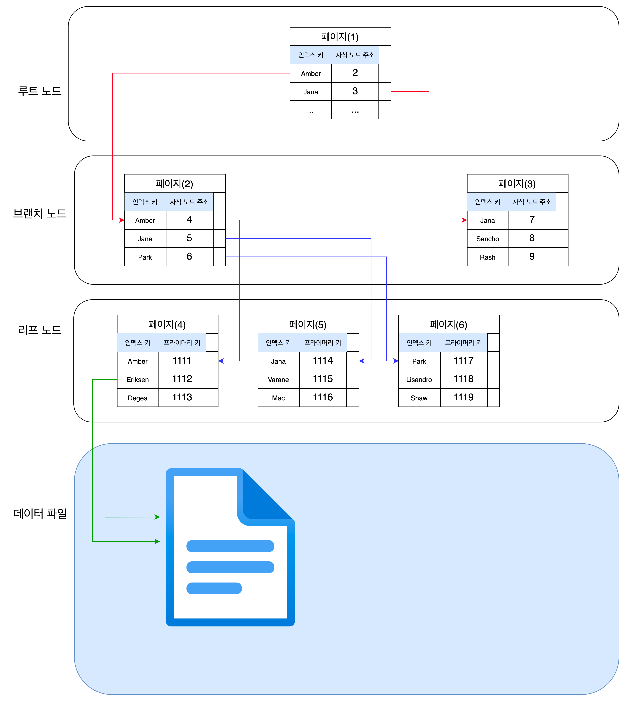

# 인덱스
```text
- 인덱스의 종류 및 특성
```

##디스크 읽기 방식
```text
- 랜덤(Random) I/O
- 순차(Sequential) I/O
- 인덱스
```
- 디스크는 컴퓨터에서 가장 느린 부분이다. 그래서 데이터베이스의 성능 튜닝은 어떻게 디스크 I/O를 줄이느냐가 관건일때가 상당히 많다.  

### HDD와 SSD(솔리드 스테이트 드라이브)
- 기계식 하드 디스크드라이브를 대체하기 위해 전자식 저장 채체인 SSD가 등장함
- HDD 와 비교시 SSD 장점음 랜덤I/O가 훨씬 빠르다.  
  DB는 랜덤I/O를 통해 작은 데이터를 읽고 쓴느 작업이 대부분이므로 SSD의 장점은 DBMS용 스토리지에 최적이라고 볼 수 있다. 

### 랜덤 I/O 와 순차 I/O
- 디스크에 데이터를 쓰고 읽는 데 걸리는 시간은 디스크 헤더를 움직여서 읽고 쓸 위치로 옮기는 단계에서 결정된다.
- 즉, 디스크의 성능은 디스크 헤더의 위치 이동 없이 얼마나 많은 데이터를 한 번에 기록하느냐에 의해 결정된다고 볼 수 있다. 
여러 번 쓰기 또는 읽기를 요청하는 랜덤 I/O 작업이 부하가 훨씬 더 크다. 그래서 그룹 커밋이나 바이너리 로그 버퍼 등이 사용되는 것.
- ***일반적으로 쿼리를 튜닝하는 것은 랜덤 I/O 자체를 줄여주는 것***이 목적이라고 할 수 있다.
  - 여기서 랜덤I/O를 줄인다는 것은 쿼리를 처리하는 데 꼭 필요한 데이터만 읽도록 쿼리를 개선하는 것을 의미한다.

## 인덱스
- 칼럼의 값과 해당 레코드가 저장된 주소를 **키와 값의 쌍**으로 삼아 인덱스를 만들어 두는 것.
- 인덱스는 항상 **정렬된 상태**를 유지한다. 데이터 파일은 저장된 순서대로 별도의 정렬 없이 그대로 저장해 둔다.

- 인덱스는 항상 정렬된 상태이기 때문에 SELECT 문장은 매우 빠르게 처리하지만,  
  INSERT, UPDATE, DELETE는 인덱스의 정렬 처리를 다시 수행해야하므로 과정이 복잡하고 느리다. 
- 다시 말해, DBMS 에서 인덱스는 데이터의 저장 성능을 희생하고 그 새신 데이터의 읽기 속도를 높이는 기능이다.
  - -> SELECT 쿼리 문장의 WHERE 조건절에 사용되는 컬럼이라고 해서 전부 인덱스로 생성하면 데이터 저장 성능이 떨어지고 인덱스의 크기가 비대해져 오히려 역효과만 불러올 수 있다.
- 인덱스의 종류
  - 분류 방법 : 데이터를 관리하는 방식, 중복 값의 허용 여부 (Real My SQL 저자가 효율적 설명을 위해 임의로 사용)
  - 역할에 의한 구분 : 프라이머리 키, 보조 키(세컨더리 인덱스)
    - 프라이머리 키 : 그 레코드를 대표하는 칼럼의 값으로 만들어진 인덱스. 식별자라고도 부름. Null, 중복 허용 X.
    - 세컨더리 인덱스 : 프라이머리 키를 제외한 나머지 모든 인덱스
#
- 데이터 저장 방식에 의한 구분
  - 대표적으로 B-Tree 인덱스와 Hash 인덱스로 구분
    - B-Tree 알고리즘:  
      컬럼의 값을 변형하지 않고 원래의 값을 이용해 인덱싱하는 알고리즘
    - Hash 인덱스:  
        컬럼의 값으로 해시값을 계산해서 인덱싱하는 알고리즘. 매우 빠른 검색을 지원한다.  
        전방 일치와 같이 값의 일부만 검색하거나 범위를 검색할 때는 해시 인덱스를 사용할 수 없다. 
- 데이터의 중복 허용 여부에 의한 구분
  - 유니크 인덱스(Unique)와 유니크하지 않은(Non-Unique) 인덱스  
    : 같은 값이 1개만 존재하는지 1개 이상 존재할 수 있는지 의미. 이는 쿼리를 실행하는 옵티마이저에게는 상당히 중요한 문제.

## B-Tree 인덱스
- Balanced Tree
- 항상 정렬된 상태로 유지한다
### 구조 및 특성
  
    - 루트 노드
    - 브랜치 노드
    - 리프 노드 : 항상 실제 데이터 레코드를 찾아가기 위한 ***주솟값***을 가지고 있다.

- MyISAM 테이블의 인덱스와 데이터 파일의 관계  
  
  - 리프 노드의 레코드 주소는 MyISAM 테이블 생성 옵션에 따라 ***레코드가 테이블에 INSERT된 순번***이거나 ***데이터 파일 내의 위치(Offset)***
  #
- InnoDB 테이블의 인덱스와 데이터 파일의 관계!  
    
  - ***프라이머리 키***가 ROWID의 역할을 한다.
- 두 스토리지 엔진의 인덱스에서 가장 큰 차이점
  - 세컨더리 인덱스를 통해 데이터 파일의 레코드를 찾아가는 방법
    - MyISAM: 세컨더리 인덱스가 물리적인 주소를 갖는다
    - InnoDB: 프라이머리 키를 주소처럼 사용하기 때문에 논리적인 주소를 갖는다
        - 인덱스를 통해 레코드를 읽을 때는 데이터 파일을 바로 찾아가지 못한다.
        ```
      1. 인덱스에 저장돼 있는 프라이머리 키 값을 이용해 프라이머리 키 인덱스를 한 번 더 검색
      2. 프라이머리 키 인덱스의 리프 페이지에 저장돼 있는 레코드를 읽는다.
      ```

### B-tree 인덱스 키 추가 및 삭제
- 인덱스 키 추가
  ```text
    1. B-tree 상의 적절한 위치를 검색한다.
    2. 리프 노드가 꽉 차서 더는 저장할 수 없을 때는 리프 노드가 분리되어야 하는데 이는 상위 브랜치 노드까지 처리 범위가 넓어진다.
    InnoDB는 체인지 버퍼를 사용해 지연처리 한다.
    ```

- 인덱스 키 삭제
  ```text
    1. 해당 키 값이 저장된 B-tree의 리프 노드를 찾아서 그냥 삭제 마크만 하면 작업이 완료된다.
    ```
  
- 인덱스 키 변경
  ```text
    1. B-tree의 키 값 변경 작업은 먼저 키 값을 삭제한 후, 다시 새로운 키 값을 추가하는 형태로 처리한다. 
    ``` 
  
- 인덱스 키 검색
  ```text
    - 루트 노드부터 시작해 브랜치 노드를 거쳐 최종 리프 노드까지 이동하면서 비교 작업을 수행한다. -> 트리 탐색
  
    - B-tree 인덱스를 이용한 검색은 100%일치 또느 값의 앞부분만 일치하는 경우에 사용 가능
  
    - 부등호 비교 조건에서도 인덱스를 활요할 수 있지만, 인덱스를 구성하는 키 값의 뒷부분만 검색하는 용도로는 인덱스를 사용할 수 없다.
   
    - 함수나 연산을 수행한 결과로 정렬한다거나 검색하는 작업은 B-tree의 장점을 이용할 수 없으므로 주의하라.
        - 이미 변형된 값은 B-tree인덱스에 존재하는 값이 아니다. 
  
    - InnoDB 테이블에서 지원하는 레코드 잠금이나 넥스트 갭락이 검색을 수행한 인덱스를 잠근 후 테이블의 레코드를 잠그는 방식으로 구현돼 있다. 
        따라서 인덱스가 없으면 불필요하게 많은 레코드를 잠근다. 그래서 인덱스 설계는 중요하다.
    ``` 